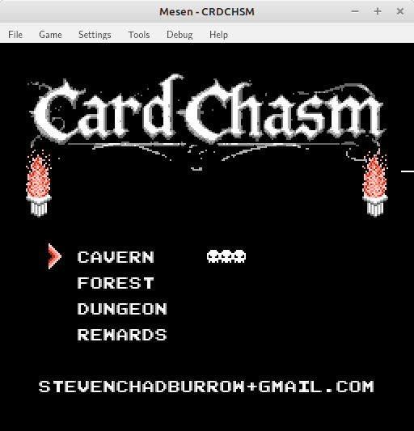
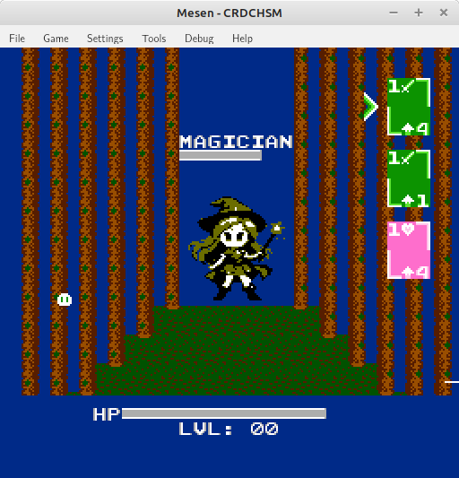

# CardChasm
Deck-building linear dungeon-divering game for the NES 

<b>Concept:</b> 
The concept behind Card Chasm is to be a simplified clone of <a href="https://play.google.com/store/apps/details?id=com.iqubi.dungeonandgirlsunity&hl=en-US">Dungeon & Girls</a>, an Android phone game that was fun, cute, and fairly simple.  You have a deck of cards with both battle effects and movement amounts.  Outside of combat, the cards move you forward some amount designated by the card.  Inside of combat, they attack, block, or heal.  Reach the end of the dungeon, fight the boss, get new cards, repeat. 

<b>Modifications:</b> 
Some modifications I am doing here are using elemental attack types and weaknesses, like a simplified Pokemon battle. The deck is 40 cards, and fully customizable, instead of only changing 5 booster cards like in the original.  I do not have a partner or choice of player.  I also am not thinking of adding special abilities, though that could be a feature implemented later.  I think the main 'hook' for this game is on a technical standpoint.  Simulating the walking effect takes a lot of special NES hardware knowledge.  So in that way, this game is kind of a demo of NES hardware capabilities. 

<b>Development:</b> 
The target mapper used for this game is the <a href="https://www.nesdev.org/wiki/UxROM">UxROM Mapper</a>, but with a small modification to the standard by adding PRG-RAM starting at $6000.  All code is in 6502 assembly, though C code is used to generate pattern table data from BMP images created in GIMP.  One of the <a href="https://perchance.org/ai-anime-generator">Perchance AI Image Generators</a> assisted in making the enemy images and the title logo.  The emulators used for testing are <a href="https://www.mesen.ca/">Mesen</a> and my own <a href="https://github.com/stevenchadburrow/PICnes">PICnes</a>. 

<b>Images:</b> 
 
 
 
 
 
